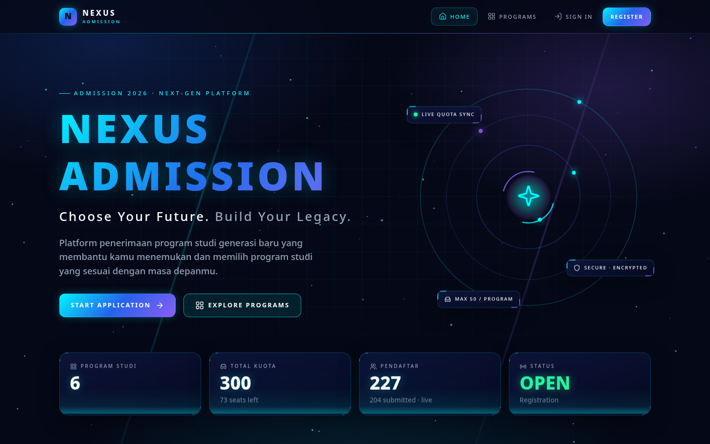
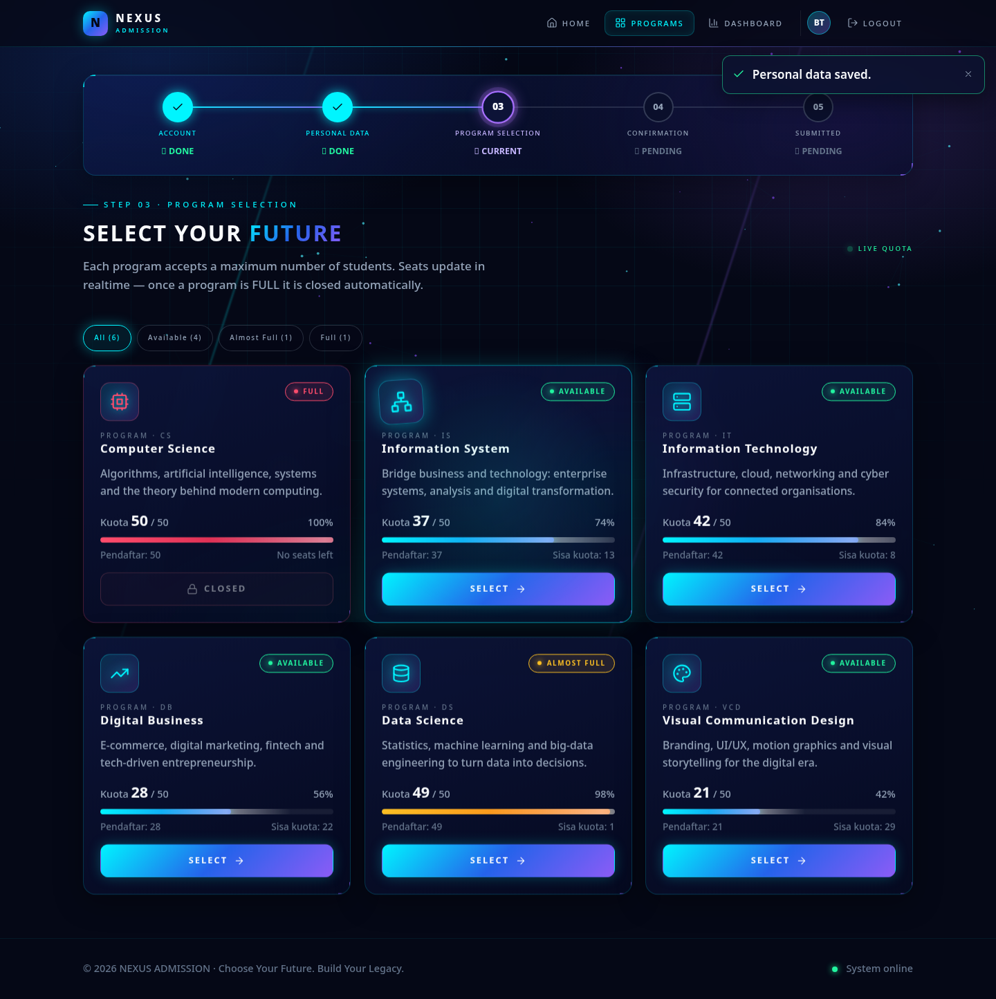
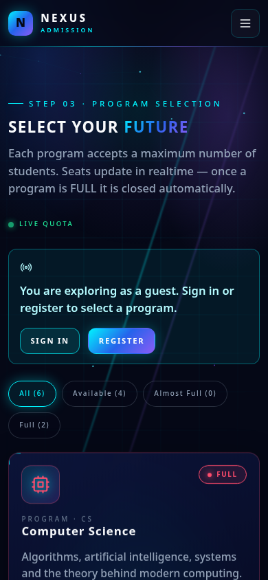
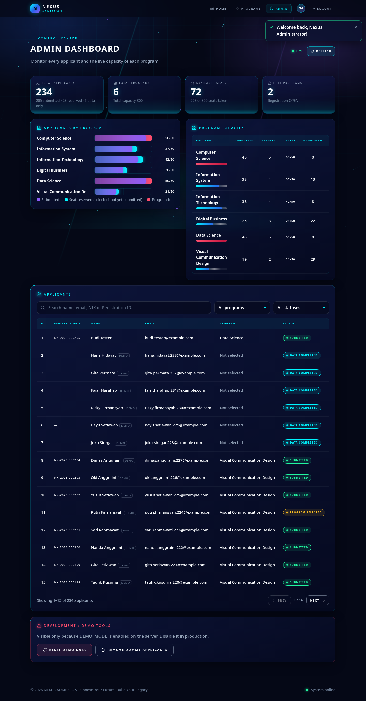
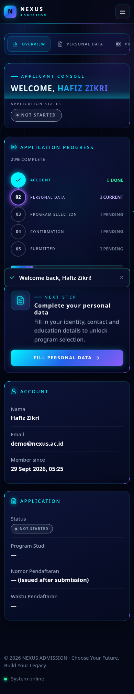
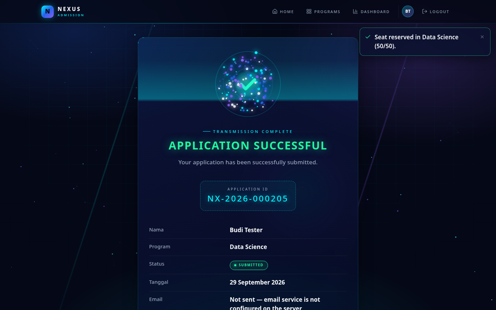
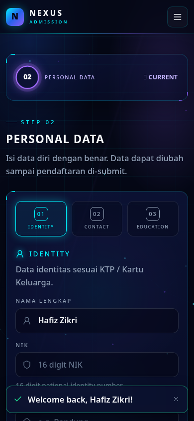

# NEXUS ADMISSION

> **Choose Your Future. Build Your Legacy.**

A study program (prodi) admission system with a futuristic holographic look. It is a working full-stack app: register → login → personal data → program selection → review → submit → Application ID → admin dashboard. The **50-seat quota is enforced in the backend and in the database**.



## Stack & catatan teknologi

| Layer | Teknologi |
|---|---|
| Backend | Node.js 22 (`node:http`), REST API + Server-Sent Events (realtime quota) |
| Database | SQLite (`node:sqlite`, built-in), quota trigger di level DB |
| Security | Password hashing **scrypt** + salt, JWT HS256, rate limit login, validasi server-side, security headers/CSP |
| Frontend | SPA vanilla JavaScript ES Modules (komponen terpisah, hash router, tanpa reload) |
| Icons | Path SVG Lucide (inline) |
| Email | Resend (HTTP API) atau SMTP via Nodemailer, credential di `.env` |

**Kenapa bukan React + Vite?** Registry npm diblokir di environment tempat project ini dibangun, jadi package seperti React, Vite, Express, dan bcrypt tidak bisa di-install. Supaya seluruh flow bisa benar-benar dijalankan dan dites dari awal sampai akhir, project ini dibuat **tanpa dependency**. Kamu cukup punya Node.js ≥ 22.13, tidak perlu `npm install`, dan tidak ada build step.

Strukturnya sengaja dibuat mirip React supaya gampang dipindah nanti:
- setiap komponen adalah fungsi yang me-return elemen (`h('div', props, ...children)` ≈ `React.createElement`)
- file di `client/src/components/*` bisa di-port satu per satu ke JSX
- `client/src/api/services.js` tetap dipakai apa adanya

---

## 1. Struktur folder

```text
nexus-admission/
├── package.json              # npm scripts (tanpa dependency)
├── .env.example              # semua konfigurasi & credential (copy ke .env)
├── shared/                   # dipakai BERSAMA oleh server & browser
│   ├── status.js             # status aplikasi, aturan kuota (FULL/ALMOST FULL), step tracker
│   └── validators.js         # validasi register/login/data diri
├── server/
│   ├── index.js              # HTTP server: API + static files + security headers
│   ├── config.js             # baca .env
│   ├── config/programs.js    # ★ DAFTAR PRODI (edit di sini)
│   ├── db/
│   │   ├── database.js       # koneksi SQLite, schema, TRIGGER kuota, transaction()
│   │   └── seed.js           # admin, akun demo, dummy applicants, reset
│   ├── repositories/         # ★ SATU-SATUNYA tempat SQL (ganti ini untuk pindah DB)
│   │   ├── userRepository.js
│   │   ├── programRepository.js
│   │   └── applicantRepository.js   # reserveSeat() = inti sistem kuota
│   ├── services/
│   │   ├── authService.js          # register, login, forgot/reset password
│   │   ├── applicationService.js   # data diri → pilih prodi → submit (aturan bisnis)
│   │   ├── adminService.js         # statistik, pencarian, reset demo
│   │   ├── emailService.js         # Resend / SMTP
│   │   └── eventService.js         # realtime quota (SSE)
│   ├── lib/  http.js (router mini), security.js (scrypt, JWT, rate limit)
│   └── routes/index.js       # daftar endpoint REST
├── client/
│   ├── index.html, favicon.svg
│   ├── styles/  base.css · effects.css · components.css · pages.css   (design system)
│   └── src/
│       ├── main.js           # boot loader "INITIALIZING NEXUS..." + start router
│       ├── routes.js         # route + flow guard (UX rules)
│       ├── core/  h.js · router.js · store.js
│       ├── api/   client.js · services.js   # ★ data layer (ganti untuk Supabase/Firebase)
│       ├── ui/    icons · toast · modal · form · effects (particles, tilt, burst) · format
│       └── components/
│           Navbar · LandingPage · LoginForm · RegisterForm · ForgotPasswordForm
│           Dashboard · ProgressTracker · PersonalDataForm · ProgramList · ProgramCard
│           ApplicationReview · SuccessScreen · AdminDashboard · ApplicantTable
│           ApplicantsChart · receipt
├── scripts/
│   ├── reset-demo.js         # npm run reset
│   └── quota-race-test.js    # npm run test:quota  (uji 50 kursi dengan request bersamaan)
└── docs/
    ├── postgres-schema.sql   # schema + fungsi kuota untuk PostgreSQL/Supabase
    └── screenshots/          # screenshot desktop / tablet / mobile
```

## 2. API

| Method | Endpoint | Keterangan |
|---|---|---|
| POST | `/api/auth/register` | buat akun (hash scrypt) |
| POST | `/api/auth/login` | login dan dapat JWT |
| GET | `/api/auth/me` | user saat ini |
| POST | `/api/auth/forgot-password` · `/api/auth/reset-password` | reset password dengan kode sekali pakai |
| GET | `/api/programs` · `/api/stats` · `/api/stream` | prodi + kuota live, statistik, realtime SSE |
| POST | `/api/applicants` | simpan data diri |
| POST | `/api/programs/select` · `/api/programs/release` | reservasi kursi / lepas kursi |
| GET | `/api/dashboard` | data dashboard user |
| POST | `/api/applications/submit` | submit final dan dapat nomor pendaftaran |
| GET | `/api/applications/receipt` | bukti pendaftaran (HTML, bisa di-print ke PDF) |
| GET | `/api/admin/overview` · `/api/applicants` · `/api/applicants/:id` | admin |
| POST | `/api/admin/reset` | reset data demo (admin + `DEMO_MODE`) |

## 3. Cara menjalankan

Yang dibutuhkan: **Node.js ≥ 22.13** (cek dengan `node -v`).

```bash
cd nexus-admission
cp .env.example .env        # opsional; tanpa .env pakai default development
npm start                   # atau: npm run dev  (auto-restart saat file server berubah)
```

Setelah itu buka **http://localhost:3000**. Saat pertama kali jalan, file database `data/nexus.db` dibuat otomatis beserta prodi, akun admin, akun demo, dan 233 dummy applicants.

## 4. Login sebagai user

- **Akun baru:** Register → otomatis masuk ke Dashboard.
- **Akun demo:** `demo@nexus.ac.id` / `Demo#2026` (nama *Hafiz Zikri*, status NOT STARTED). Di halaman login ada tombol **Applicant** untuk mengisi kredensial ini otomatis (hanya muncul saat DEMO_MODE aktif).

Flow lengkapnya: Dashboard → **Fill Personal Data** (IDENTITY / CONTACT / EDUCATION) → **SELECT** prodi → **Application Review** → centang konfirmasi → **SUBMIT APPLICATION** → **CONFIRM** → halaman sukses dengan Application ID `NX-2026-000xxx` → **Download Registration Receipt**.

Aturan UX yang ditegakkan di frontend **dan** backend:
- Belum isi data diri → tidak bisa memilih prodi.
- Belum memilih prodi → tidak bisa submit.
- Sudah submit → data, prodi, dan submit ulang terkunci untuk akun itu.
- Satu NIK hanya boleh dipakai satu pendaftaran yang sudah di-submit.

## 5. Login sebagai admin

`admin@nexus.ac.id` / `Admin#2026`. Nilai ini bisa diganti lewat `ADMIN_EMAIL` / `ADMIN_PASSWORD` di `.env`, dan akun admin dibuat saat server start jika belum ada. Setelah login, kamu otomatis diarahkan ke `/#/admin`.

Admin dashboard berisi:
- statistik TOTAL APPLICANTS, TOTAL PROGRAMS, AVAILABLE SEATS, FULL PROGRAMS
- grafik *Applicants by Program* dan tabel kapasitas per prodi
- tabel pendaftar dengan search (nama / email / NIK / ID), filter prodi, filter status, pagination, dan detail pendaftar (klik baris)
- data yang update otomatis secara realtime
- **Development / Demo Tools**: **RESET DEMO DATA** (dengan konfirmasi "Reset all applicants?") dan **REMOVE DUMMY APPLICANTS**. Keduanya hanya muncul jika `DEMO_MODE=true`.

Reset juga bisa dilakukan dari terminal: `npm run reset`.

## 6. Cara testing sistem kuota 50 orang

**Cara kerja kuota**
- Kursi terhitung sejak user menekan **SELECT** (status `PROGRAM_SELECTED`, *applicants + 1*). Dengan begitu user yang sedang di halaman review pasti bisa submit.
- Kursi dilepas jika user pindah prodi atau menekan **Release Seat** sebelum submit.
- Jumlah pendaftar selalu **dihitung dari tabel `applicants`**, bukan angka terpisah yang bisa meleset.

**Proteksi berlapis**
1. `applicationService.selectProgram` berjalan dalam transaksi `BEGIN IMMEDIATE`.
2. `applicantRepository.reserveSeat` memakai satu `UPDATE ... WHERE (jumlah kursi lain) < capacity`, sehingga pengecekan dan penulisan terjadi atomik.
3. Trigger `trg_quota_insert` / `trg_quota_update` di database menolak baris ke-51 walaupun ada kode lain yang lupa mengecek.

**Test manual (browser)** — dengan data demo:
- **Computer Science** sudah `50/50 FULL`, jadi tombolnya **CLOSED** dan disabled.
- **Data Science** `49/50`. Daftar dengan akun baru dan pilih Data Science → jadi `50/50 FULL`.
- Buka akun lain (atau jendela incognito): Data Science sekarang **CLOSED**. Angkanya berubah realtime tanpa refresh.

**Test serangan bersamaan (otomatis):**
```bash
npm start                                  # terminal 1
npm run test:quota                         # terminal 2: Data Science, (sisa kursi + 10) user menekan SELECT bersamaan
npm run test:quota -- --program VCD --users 40
```
Contoh output saat verifikasi (sisa kursi Data Science 1, 15 user bersamaan):
```text
Accepted: 1   Rejected (PROGRAM_FULL): 14   Other errors: 0
Final: Data Science  50/50  -> FULL
✅ PASS — quota was never exceeded.
```

## 7. Cara mengganti daftar prodi

Edit `server/config/programs.js`:
```js
{ code: 'SE', name: 'Software Engineering', icon: 'cpu', description: '...', seedApplicants: 0 },
```
Lalu restart server. Prodi otomatis disinkronkan ke database:
- `code` baru → ditambahkan
- prodi yang sudah ada → di-update
- `code` yang dihapus → disembunyikan (history pendaftar tetap aman)

Icon yang tersedia: `cpu, network, server, trending, database, palette` (atau tambahkan sendiri di `client/src/ui/icons.js`).

## 8. Cara mengganti kapasitas kuota

- **Semua prodi:** set `PROGRAM_CAPACITY=60` di `.env`, lalu restart.
- **Per prodi:** tambahkan `capacity: 30` pada item di `server/config/programs.js`.

Status FULL / ALMOST FULL (≥ 90%) dan tombol CLOSED akan mengikuti otomatis. Ambang ALMOST FULL bisa diubah di `shared/status.js` (`ALMOST_FULL_RATIO`).

## 9. Cara menghubungkan database lain (PostgreSQL / MySQL / Supabase / Firebase)

Semua SQL ada di `server/repositories/*.js`. Service, route, dan frontend tidak perlu diubah.

1. Jalankan `docs/postgres-schema.sql` di PostgreSQL / Supabase. File ini sudah berisi fungsi `reserve_seat()` yang memakai `SELECT ... FOR UPDATE` supaya kuota tetap aman saat ada request bersamaan.
2. Install driver (mis. `npm install pg`), lalu tulis ulang fungsi di ketiga repository dengan nama dan return value yang sama. Contoh:
   ```js
   reserveSeat: async (applicantId, programId) =>
     (await pool.query('SELECT reserve_seat($1,$2) AS ok', [applicantId, programId])).rows[0].ok,
   ```
   Ganti `transaction()` di `db/database.js` dengan `BEGIN/COMMIT` dari driver, lalu tambahkan `await` di service.
3. Simpan connection string di `.env` (mis. `DATABASE_URL=`), **jangan** di frontend.

Untuk **Supabase / Firebase tanpa backend ini**, implementasikan ulang `client/src/api/services.js`. Tetap pastikan kuota divalidasi di server lewat RPC/function (`reserve_seat`) atau Cloud Function, jangan dari browser.

## 10. Cara menghubungkan email notification

Setelah submit, server mengirim email **NEXUS ADMISSION — APPLICATION CONFIRMATION** berisi Nama, Program Studi, Nomor Pendaftaran, Tanggal, dan Status (lihat `server/services/emailService.js`). Hasil pengiriman dicatat di kolom `email_status` dan ditampilkan apa adanya ke user dan admin:

| Status | Arti |
|---|---|
| `SENT` | email terkirim |
| `FAILED` | pengiriman gagal; pendaftaran **tetap sah** |
| `NOT_CONFIGURED` | email belum dikonfigurasi, dan **tidak ada pesan palsu "email terkirim"** |

**Resend**
```env
EMAIL_PROVIDER=resend
RESEND_API_KEY=re_xxxxxxxx
EMAIL_FROM="NEXUS ADMISSION <no-reply@domain-terverifikasi.com>"
```

**SMTP (Gmail App Password, Mailtrap, dan lain-lain)**
```bash
npm install nodemailer
```
```env
EMAIL_PROVIDER=smtp
SMTP_HOST=smtp.gmail.com
SMTP_PORT=587
SMTP_USER=you@gmail.com
SMTP_PASS=app-password
```

Setelah itu restart server. Log startup akan menampilkan `email: resend` / `email: smtp`. Email yang sama juga dipakai untuk **Forgot Password**: kode reset 8 karakter berlaku 15 menit.

Tanpa email dan saat DEMO_MODE aktif, kode reset ditampilkan di layar dengan label *DEMO MODE* supaya flow tetap bisa dites. Di production tanpa email, fitur reset password menolak dengan pesan yang jelas.

**EmailJS** tidak dipakai karena mengirim dari browser. Credential sebaiknya tetap di server.

---

## Production checklist

- `NODE_ENV=production`, `JWT_SECRET` acak (≥ 32 karakter), `ADMIN_PASSWORD` kuat, `DEMO_MODE=false` (server menolak start jika secret belum di-set)
- Jalankan di belakang HTTPS (Nginx/Caddy)
- Untuk lebih dari satu instance server: pindah ke PostgreSQL dan simpan rate limit di Redis
- Token saat ini disimpan di `localStorage` (sederhana untuk prototype). Untuk keamanan lebih, pindahkan ke cookie `HttpOnly`.

## Screenshots

| Desktop | Mobile |
|---|---|
|  |  |
|  |  |
|  |  |
